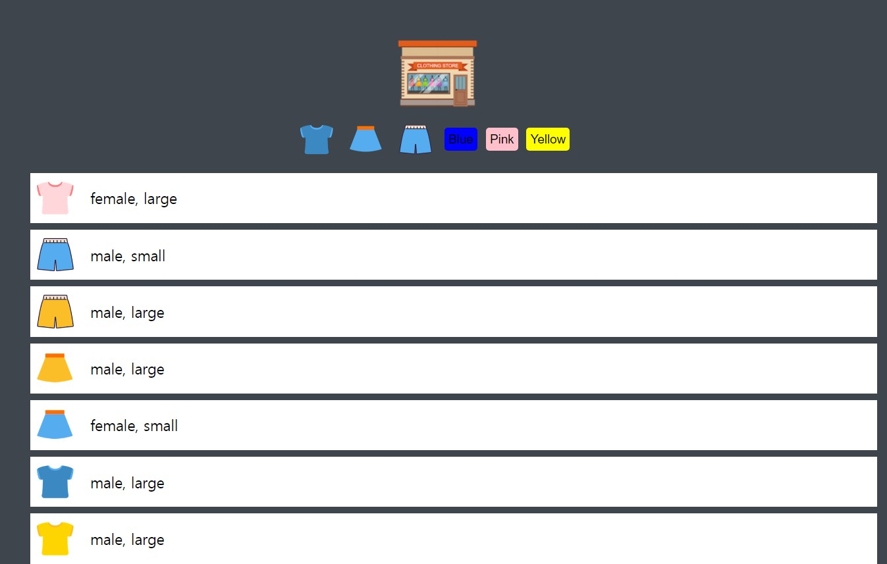
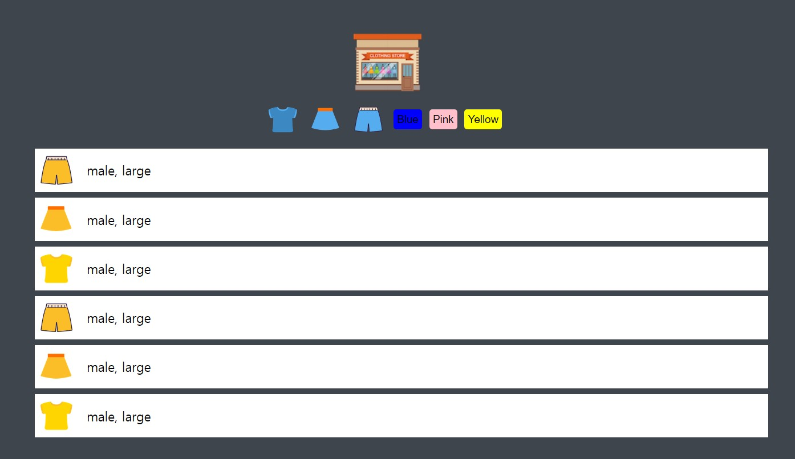

# makingShoppingMall

<ul>
  <li>프로젝트 이름: Vanila Javascript Practice</li>
  <li>사용된 기술 : HTML, CSS, JavaScript</li>
  <li>기능 : 데이터 로딩하여 list로 정렬, 버튼 클릭시 필터링 기능 제공</li>
</ul>
 

<h2> Main Page </h2>

 

<h2> Filtered Page </h2>

